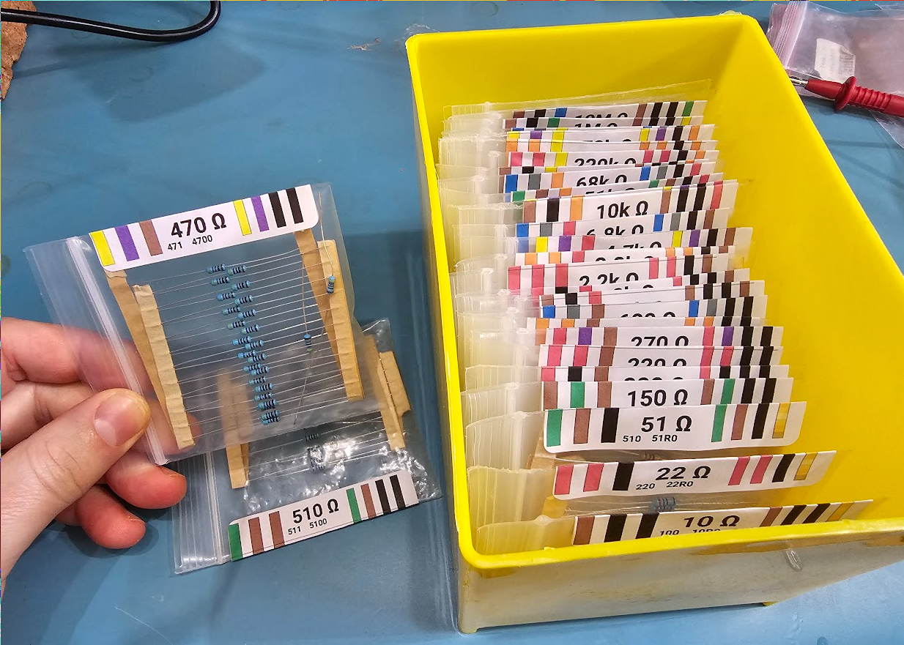

# ComponentLabels

This script generates labels for zip bags with all sorts of electronic or mechanical components.

It is primarily meant for [these](https://www.obalyvysocina.cz/produkty/samolepici-etikety) labels (70x25.4 mm) and 8x12 cm zip bags. However, the generator script also supports AVERY 5260 or AVERY L7157 labels.

## Supported components

- Resistors (+ 3 & 4 digit SMD code, EIA-96 code and 3 & 4 band color codes)
- Capacitors (+ 3 digit SMD code, EIA-198 code and 3 band color code (yes, those appear to actually exist))
- Diodes & Schottky diodes (+ forward voltage/current, reverse voltage)
- Zener diodes (+ reverse voltage/current, forward voltage)
- LEDs (+ forward voltage/current, wavelength)
- PNP/NPN BJT (+ base-emittor voltage, collector-emittor voltage/current)
- P/N-channel MOSFET (+ gate-source voltage, drain current, drain-source voltage)
- Square/Hexagonal nuts (+ thickness, width and diameter)
- Recessed/Round-head screws (+ head width, head height and screw length)

# Usage

- Install python3
- Install the python3 library `reportlab`. This library is used to do the actual PDF generation.
- Add your own required resistor values in `main()` of `LabelGenerator.py`.
- If using Avery L7157 or 5260, change the `layout` value in `main()` to `AVERY_L7157` or `AVERY_5260`.
- Run the script `LabelGenerator.py`!

It will now generate a `ResistorLabels.pdf` that can be used to print onto AVERY 5260/L7157.

# More Details

This is forked from https://github.com/securelyfitz/ResistorLabels, which is in turn a fork of https://github.com/Finomnis/ResistorLabels

The original is based on an idea from Zach Poff. I liked the design of securelyfitz's forked labels, I just needed to implement more than resistors.

For more details on how to use these labels, visit Zach's website:

https://www.zachpoff.com/resources/quick-easy-and-cheap-resistor-storage/
